<!--
##############################################################################
# This file is part of the YADTK Toolkit (Yet Another Dialogue Toolkit)
# Copyright © Jérôme Lehuen 2010-2015 - Jerome.Lehuen@univ-lemans.fr
#
# This software is governed by the CeCILL license under French law and
# abiding by the rules of distribution of free software. You can use,
# modify and/or redistribute the software under the terms of the CeCILL
# license as circulated by CEA, CNRS and INRIA (http://www.cecill.info).
#
# As a counterpart to the access to the source code and rights to copy,
# modify and redistribute granted by the license, users are provided only
# with a limited warranty and the software's author, the holder of the
# economic rights, and the successive licensors have only limited
# liability.
#
# In this respect, the user's attention is drawn to the risks associated
# with loading, using, modifying and/or developing or reproducing the
# software by the user in light of its specific status of free software,
# that may mean that it is complicated to manipulate, and that also
# therefore means that it is reserved for developers and experienced
# professionals having in-depth computer knowledge. Users are therefore
# encouraged to load and test the software's suitability as regards their
# requirements in conditions enabling the security of their systems and/or
# data to be ensured and, more generally, to use and operate it in the
# same conditions as regards security.
#
# The fact that you are presently reading this means that you have had
# knowledge of the CeCILL license and that you accept its terms.
##############################################################################

# This free software is registered at the Agence de Protection des Programmes.
# For further information or commercial purpose, please contact the author.
-->

<!--img src="under.png" align="right"-->

<a name="Toc"></a>

<font size="+2">
**<font color="#2ECCFA">Y</font>et <font color="#2ECCFA">A</font>nother <font color="#2ECCFA">D</font>ialogue <font color="#2ECCFA">T</font>ool<font color="#2ECCFA"> K</font>it
An open-source toolkit to build
Spoken Dialogue Systems**
</font>

[](http://www.univ-lemans.fr/en)&nbsp;&nbsp;&nbsp;[](http://www-lium.univ-lemans.fr/en/content/language-and-speech-technology-lst)
[](http://www.ouest-valorisation.fr)&nbsp;&nbsp;&nbsp;[](http://www.app.asso.fr)

Copyright © 2015 [Jérôme Lehuen](http://www-lium.univ-lemans.fr/~lehuen/webpage/home.php)
[Language and Speech Technology Team](http://www-lium.univ-lemans.fr/en/content/language-and-speech-technology-lst)
[Université du Maine](http://www.univ-lemans.fr/en) Le Mans, France

*This free software is registered at the [Agence de Protection des Programmes](http://www.app.asso.fr)
and distributed under a [CeCILL License](http://www.cecill.info/licences/Licence_CeCILL_V2.1-en.txt) for a non-commercial use.
For further information or commercial purpose, please contact the author.*

[](http://twitter.com/lehuenyadtk)

## Table of Contents

1. [Yet Another Dialogue Toolkit](#section1)
	- [How to use YADTK](#section12)
	- [Requirements and installation](#section13)
	- [Configuration instructions](#section15)
	- [Compilation instructions](#section16)
2. [The Granule Model](#section2)
3. [The YASPML formalism](#section3)
	- [Flexible dependencies](#section31)
	- [Multiple dependencies](#section32)
	- [Boolean constraints](#section33)
	- [Calculated offers](#section34)
	- [Transferred offers](#section35)
	- [Interrogations and negations](#section36)
4. [The YASP understanding module](#section4)
	- [Dealing with redundancies](#section41)
	- [Dealing with ambiguities](#section42)
	- [The Granule Guesser](#section43)
	- [Non-regression testing](#section44)
	- [Batched parsing](#section45)
5. [The YAGE generation module](#section5)
6. [The YADE dialogue controller](#section6)
	- [The working memory](#section61)
	- [YADE in action](#section62)
	- [Non-regression testing](#section63)
	- [How to write I/O plugins](#section64)
7. [The YADEML formalism](#section7)
	- [Manipulating the G-structures](#section71)
	- [Dealing with the user's utterances](#section72)
	- [Generating the system's utterances](#section73)
	- [Example of a system of nested rules](#section74)
8. [Bibliography](#section8)

<a name="section1"></a>
## 1. Yet Another Dialogue Toolkit<div style="float:right;">[](#Toc)</div>

YADTK (YaDeeTeeKay) is an open-source toolkit to develop rule-based spoken dialogue systems. It is composed of several modules, all based on a unified semantic model, called the [Granule Model](#section2). As our objective is the development of spoken dialogue systems by end-users, the YADTK toolkit is totally rule-based. Thus, there is no need to create and to annotate big corpora before beginning to design dialogue systems. In contrast, the knowledge must be hand defined using two very understandable (and extensible) XML formalisms. It is also maintainable and reusable, if it is well designed, organized and documented. YADTK is distributed without any integrated ASR module (automatic speech recognition). However, it is easy to join any additional module, thanks to its client-server architecture, implemented as Python scripts. Moreover, YADTK comes with an ASR client that uses the Google&trade; Speech Recognition API.
 
The YADTK dialogue toolkit now contains:

- An understanding module called **YASP** (Yet Another Semantic Parser);
- A generation module called **YAGE** (Yet Another Generator);
- A dialogue controller called **YADE** (Yet Another Dialogue Engine);
- A graphical visualization tool that show semantic structures;
- A client to proceed to non-regression tests (NRT) during the development of YASPML knowledge
- A client to proceed to non-regression tests (NRT) during the development of YADEML knowledge
- A YASP client that allows you to test the YASP server separately;
- A YAGE client that allows you to test the YAGE server separately;
- A YADE client that allows you to test a keyboarded dialogue system;
- An ASR client that allows you to test a real spoken dialogue system;
- A speech synthesis feature (only on MacOS platforms).

This is a screenshot which shows some components and plugins of the YADTK toolkit:

<center>

</center>

As the communication layer is implemented with Python sockets, it is very easy to modify or to enhance the architecture. The figure 1 show all the possibilities of use of YADTK. The configurations are detailled in the section [Configuration instructions](#section15) below.

<center>
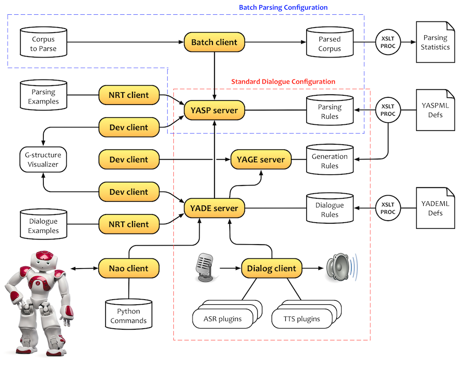
Figure 1: The client-server architecture
</center>

As discussed above, the knowledge is described using two quite simple XML formalism:

- **YASPML** that describe the knowledge for the understanding and the generation abilities;
- **YADEML** that describe the knowledge for the inference and the dialogue abilities.

In principle, no syntactic parsing or POS tagging or additional knowledge are required. However, YADTK includes a minimalist POS Tagger for French and for English. This allow you to specify [lemmatized forms](#patterns) into the syntactic patterns, and also to take advantage of the [Granule Guesser](#section43). Except for these optional features, all the required knowledge is concentrated into the YASPML and the YADEML descriptions.

> In this document, all the figures that contain granules are generated by the Granule Visualizer, that is a part of the YADTK toolkit. This component requires the installation of Graphviz. This is explained in the section Installation.

<a name="section12"></a>
### How to use YADTK<div style="float:right;">[](#Toc)</div>

If you just want to <font color="red">use an existing configuration</font>, run it with the command <tt>run.bash configurations.xml &lt;ident></tt>. The corresponding knowledge must be compiled. If it is not, execute the command <tt>compiler.bash &lt;application></tt>.

If you want to <font color="red">modify an existing knowledge</font>, edit the files in the folders <tt>APPLICATIONS/&lt;application>/YASP_data/</tt> and <tt>APPLICATIONS/&lt;application>/YADE_data/</tt>. Then compile the knowledge and run the configuration, like explained above.

If you want <font color="red">to create a new application</font>, execute the script `newapp.bash <name>`. It creates data folders that contains a new basic knowledge. Edit this knowledge, create a new configuration and run it.

All the procedures and scripts are explained in this documentation.

<table border="0">
	<tr>
		<td valign="top" width="180"></td>
		<td valign="top">
		<b>Here are the main scripts you will need to use:</b>
		<br/>
		<ul>
			<li>The script <tt>install.bash</tt> installs the minimum required to start with YADTK. <font color="red"><i>If you encounter problems with the automatic procedure, try the manual one.</i></font>
			<li>The command <tt>compiler.bash &lt;application></tt> compiles and deploys an existing knowledge into the target data folders. <font color="red"><i>You must launch this script at least once and after any change on a knowledge file.</i></font> 
			<li>The command <tt>run.bash configurations.xml &lt;ident></tt> launches the YADTK configuration which is identified by <tt>&lt;ident></tt> in the configuration file. <font color="red"><i>You can edit this file in order to specify your own configurations.</i></font>
			<li>The script <tt>newapp.bash</tt> allows you to create a new application. It asks you the name of the application, then creates data folders that contains a new basic knowledge. <font color="red"><i>Use this script only if you want to create a new application.</i></font>
			<li>The folders <tt>YASP_data</tt> and <tt>YADE_data</tt> contain the knowledge folders. For example, the folders <tt>YASP_data/TEST_FR</tt> and <tt>YADE_data/TEST_FR</tt> contain the knowledge files for the application <tt>TEST_FR</tt>. 
			</ul>
		</td>
	</tr>
</table>

<a name="section13"></a>
### Requirements and 3rd party software<div style="float:right;">[](#Toc)</div>

YADTK is developed on a MacOS platform but it should works on any Linux platform that  contains Python 2.7, the **gcc** compiler, the bash shell, the **xmllint** and the **xsltproc** unix tools. Under MacOS, a few AppleScript&trade; scripts are used to reorganize the terminal windows.

- YADTK is mainly based on the **CLIPS** inference engine and language.

- The visualization tool is based on XSLT transformations and on the **Graphviz** toolkit.

- The Google&trade; Speech Recognition API requires an key. If not specified, it uses a generic key that may be revoked by Google in the future. Instead, it is best to obtain your own API key by following the steps on the [API Keys page](http://www.chromium.org/developers/how-tos/api-keys) at the Chromium Developers site.

- The YADE client can use the speech synthesis feature that is included into MacOS system (command say).

Most of these tools and their documentation are available for MacOSX in the folder `YADTK/OTHER/3rdParty` but you can also download them:

| Name           | Web site                                        | License
|:---------------|:------------------------------------------------|:------------------
| CLIPS          | http://clipsrules.sourceforge.net               | Public Domain
| Graphviz       | http://www.graphviz.org                         | Eclipse
| PyCLIPS        | http://pyclips.sourceforge.net                  | LGPL
| PyPDF2         | https://pypi.python.org/pypi/PyPDF2             | BSD
| Pyaudio        | http://people.csail.mit.edu/hubert/pyaudio      | MIT
| Speech         | https://pypi.python.org/pypi/SpeechRecognition  | BSD
| Termcolor      | https://pypi.python.org/pypi/termcolor          | MIT
| LEFFF          | http://www.labri.fr/perso/clement/lefff         | LGPLLR
| XTAG           | http://www.cis.upenn.edu/~xtag/gramrelease.html | GPL

### Installation procedure<div style="float:right;">[](#Toc)</div>

- First [download](http://www-lium.univ-lemans.fr/~lehuen/yadtk/Download/) the YADTK toolkit
- Unzip the file `YADTK_complete_xxxxxx-xxxx`
- Open a terminal in the `YADTK_FOLDER` folder

<font color="red">On Linux, check that you have the **universe** repository enabled: [Howto](http://installion.co.uk/ubuntu/saucy/universe/p/python-clips/install/index.html)</font>

- The script `install-macos.bash` installs YADTK on MacOS platforms. It not requires any Internet connection.

- The script `install-ubuntu.bash` installs YADTK on Ubuntu platforms. It requires an Internet connection. You can configure a proxy at the beginning of the script.

<a name="section15"></a>
### Configuration instructions<div style="float:right;">[](#Toc)</div>

YADTK is composed of several servers and several clients. A configuration describes at least one server, and one client. Some typical configurations are described in the file `configurations.xml`. To use YADTK, enter the command `run.bash <config-file> <config-ident>`. For example, the command `run.bash configurations.xml demo_yade_en` launches the second configuration described in the XML file below. <font color="red">Before launching a configuration for the first time, you have to compile the corresponding knowledge</font> by the use of the script `compiler.bash` described in the section [compilation instructions](#section16).

```
<configurations>
	
	<!-- Examples of configurations for dialogue testing -->

	<config id="demo_yade_fr" knowledge="DEMO_FR">
		<server-yasp position="500+030" port="12345" trace="TRUE" debug="FALSE" leven="FALSE" tagger="TRUE" lang="fr"/>
		<server-yage position="500+400" port="12346" trace="TRUE" debug="FALSE"/>
		<server-yade position="600+100" port="12347" trace="TRUE" debug="FALSE" mirror="FALSE"/>
		<client-yade position="600+470" script="yadeclient.py" visualization="TRUE">
            <import module="hotels" base="hotels"/>
            <import module="expression" face="woman"/>
			<import module="google_asr" lang="fr-FR"/>
			<import module="apple_tts" voice="Aurelie"/>
		</client-yade>
		<control-panel position="30+500"/>
	</config>
	
	<config id="demo_yade_en" knowledge="DEMO_EN">
		<server-yasp position="500+030" port="12345" trace="TRUE" debug="FALSE" leven="FALSE" tagger="TRUE" lang="en"/>
		<server-yage position="500+400" port="12346" trace="TRUE" debug="FALSE"/>
		<server-yade position="600+100" port="12347" trace="TRUE" debug="FALSE" mirror="FALSE"/>
		<client-yade position="600+470" script="yadeclient.py" visualization="TRUE">
			<import module="keyboard"/>
		</client-yade>
		<control-panel position="30+50"/>
	</config>
	    
	<!-- Examples of configurations for YASPML unitary testing -->

	<config id="demo_yasp_fr" knowledge="DEMO_FR">
		<server-yasp position="500+030" port="12345" trace="TRUE" debug="FALSE" leven="FALSE" tagger="TRUE" lang="fr"/>
		<client-yasp position="500+400" script="yaspclient.py" visualization="TRUE"/>
		<control-panel position="30+50"/>
	</config>
	
	<config id="demo_yasp_en" knowledge="DEMO_EN">
		<server-yasp position="500+030" port="12345" trace="TRUE" debug="FALSE" leven="FALSE" tagger="TRUE" lang="en"/>
		<client-yasp position="500+400" script="yaspclient.py" visualization="TRUE"/>
		<control-panel position="30+50"/>
	</config>
	
	<config id="demo_yage" knowledge="DEMO_FR">
		<server-yage position="500+030" port="12345" trace="TRUE" debug="FALSE"/>
		<client-yage position="500+400" script="yageclient.py"/>
		<control-panel position="30+50"/>
	</config>
	
	<!-- Examples of configurations for non-regression testing -->
	<!-- You can specify an absolute path for the input files -->

	<config id="demo_yasp_nrt" knowledge="DEMO_FR">
		<server-yasp position="500+030" port="12345" trace="TRUE" debug="FALSE" leven="FALSE" tagger="TRUE" lang="fr"/>
		<client-yasp position="500+400" script="yaspclient_nrt.py" input="APPLICATIONS/DEMO_FR/data/yasp_nrt.xml"/>
	</config>
	
	<config id="demo_yade_nrt" knowledge="DEMO_FR">
		<server-yasp position="500+030" port="12345" trace="TRUE" debug="FALSE" leven="FALSE" tagger="TRUE" lang="fr"/>
		<server-yage position="500+400" port="12346" trace="TRUE" debug="FALSE"/>
		<server-yade position="600+100" port="12347" trace="TRUE" debug="FALSE" mirror="FALSE"/>
		<client-yade position="600+470" script="yadeclient_nrt.py" input="APPLICATIONS/DEMO_FR/data/yade_nrt.txt"/>
	</config>
	
	<!-- Example of configuration for batched parsing -->
	<!-- You can specify an absolute path for the input files -->
	
	<config id="batch" knowledge="DEMO_FR">
		<server-yasp position="500+030" port="12345" trace="TRUE" debug="FALSE" leven="FALSE" tagger="TRUE" lang="fr"/>
		<client-yasp position="500+400" script="yaspclient_batch.py"
			input="/Users/lehuen/Documents/Universite/Recherche/corpus_RITEL/ritel_3692.txt" pdf="TRUE"/>
	</config>
    
</configurations>
```

<center>

Configuration named `demo_yade_fr`
</center>

<center>
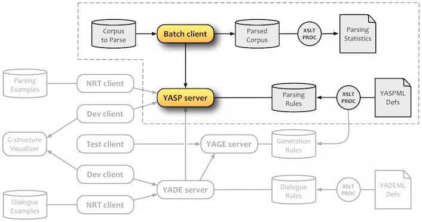
Configuration named `ritel_batch`
</center>

>If you are on an OS X platform, you can use the embedded TTS feature. Set the `voice` attribute to define the speech synthesizer voice. **Karen** (english) and **Aurelie** (french) are hight quality voices. Here's how to add new voices:
>
- Open System Preferences » Speech » Text to Speech;
- Click on the System Voice: menu and select Customize;
- You're presented with a huge list of voices to choose from;
- Click on a voice and press Play to preview it;
- Check the boxes to the left of the ones you like, then click OK.

<a name="section16"></a>
### Compilation instructions<div style="float:right;">[](#Toc)</div>

There is not a real compilation step, like from C language, but a translation to CLIPS rules, starting from the XML descriptions. When you start with a new knowledge base, or after modifying one of them, you must compile it with the command `compiler.bash <application>`.

This is what you can see after you enter the command `compiler.bash TEST_EN`:

```
Preparing the TEST_EN knowledge...
--------------------------------------------------------------------------------
Validating XML files
--------------------------------------------------------------------------------
Parsing /Users/.../YADTK/YASP_data/TEST_EN/granules.xml
Parsing took 4 ms
Freeing took 0 ms
Parsing /Users/.../YADTK/YASP_data/TEST_EN/lexicon.xml
Parsing took 1 ms
Freeing took 0 ms
Parsing /Users/.../YADTK/YADE_data/TEST_EN/yaderules.xml
Parsing took 1 ms
Freeing took 0 ms
--------------------------------------------------------------------------------
Statistics on knowledge
--------------------------------------------------------------------------------
Number of granules: 31
Number of features: 32
Number of dependencies: 28
Number of patterns: 57
--------------------------------------------------------------------------------
Processing XSLT transformations
--------------------------------------------------------------------------------
Parsing stylesheet /Users/.../YADTK/COMPILER/granules.xsl took 0 ms
Parsing document /Users/.../YADTK/YASP_data/TEST_EN/granules.xml took 2 ms
Running stylesheet and saving result took 5 ms
Parsing stylesheet /Users/.../YADTK/COMPILER/lexicon.xsl took 0 ms
Parsing document /Users/.../YADTK/YASP_data/TEST_EN/lexicon.xml took 0 ms
Running stylesheet and saving result took 2 ms
Parsing stylesheet /Users/.../YADTK/COMPILER/yaderules.xsl took 0 ms
Parsing document /Users/.../YADTK/YADE_data/TEST_EN/yaderules.xml took 0 ms
Running stylesheet and saving result took 0 ms
--------------------------------------------------------------------------------
Optional terms combination
--------------------------------------------------------------------------------
Loading /Users/.../YADTK/COMMON/clips/utils.clp...
Loading /Users/.../YADTK/COMMON/clips/lexique.clp...
Loading /Users/.../YADTK/YASP_data/TEST_EN/_lexique.clp...
--------------------------------------------------------------------------------
Generation of YASP rules
--------------------------------------------------------------------------------
Defining defrule: ETAPE2::cree-granule-hello-1 (hello)...
Defining defrule: ETAPE2::cree-granule-hello-2 (hi)...
Defining defrule: ETAPE2::cree-granule-please-3 (please)...
Defining defrule: ETAPE2::cree-granule-request-4 (I don' t want)...
Defining defrule: ETAPE2::cree-granule-request-5 (I don' t want A1)...
etc.

--------------------------------------------------------------------------------
Generation of YAGE rules
--------------------------------------------------------------------------------
Defining defrule: YAGE::genere-granule-ticket-s65 (tickets to A4)...
Defining defrule: YAGE::genere-granule-ticket-s66 (A2 tickets to A4)...
Defining defrule: YAGE::genere-granule-ticket-s67 (A1 tickets to A4)...
Defining defrule: YAGE::genere-granule-ticket-s68 (A1 A2 tickets to A4)...
Defining defrule: YAGE::genere-granule-ticket-s69 (ticket to A4)...
etc.

--------------------------------------------------------------------------------
Everything is OK
```

<a name="section2"></a>
## 2. The Granule Model<div style="float:right;">[](#Toc)</div>

The Granule Model is both a generalization and an operationalization of the *Schéma Actanciel* (stemma) proposed by the French linguist [Lucien Tesnière](http://en.wikipedia.org/wiki/Lucien_Tesnière) in the frame of the Structural Syntax. Basically, a stemma is a tree diagram, in which the verbal node takes a central place. It is capable of governing a number of arguments called actants (actor, agent, patient, instrument) and circonstants (adverbial phrases of time, of place, of manner, etc.). As the Fillmore’s Case Grammar, one of its major interests is to take into account both syntax, semantics and pragmatics.

In the Granule Model, we have tried to generalize this definition. A granule represents a significant unit (object, action, speech act, grammatical word, etc.) which is relevant or useful to the target task and/or to the dialogue. Each granule has a concept identifier, some semantic features that characterizing its offers, and can have some expectations. This defines the potential dependencies between granules. Each one has also a set of syntactic patterns that describes all its possible verbalizations.

The following figure represents the model of a granule having a valence of two, that to say with two potential dependencies. Each of them has a set of expected features, a set of required features, and a set of rejected features:

<center>

Figure 2: The Granule Model
</center>

A **semantic feature** is just a symbolic constant that contributes to categorize a granule. The kinds of features that you use greatly depend on what you want to categorize. In the following example, some concepts are defined using positive and negative features. Negative (rejected) features are only used in the definitions of dependencies, not offers.

| &nbsp; | human   | adult   | male   | female  | animated |
|:-------|:-------:|:-------:|:------:|:-------:|:--------:|
| man    | +       | +       | +      | &nbsp;  | +        |
| woman  | +       | +       | &nbsp; | +       | +        |
| boy    | +       | &ndash; | +      | &nbsp;  | +        |
| girl   | +       | &ndash; | &nbsp; | +       | +        |
| cat    | &ndash; | +       | &nbsp; | &nbsp;  | +        |
| kitten | &ndash; | &ndash; | &nbsp; | &nbsp;  | +        |
| table  | &ndash; | &nbsp;  | &nbsp; | &nbsp;  | &ndash;  |

Starting from the table above, the set {+human, &ndash;adult} can accepts the granules [boy] and [girl].

<font color="red"><i>It is important to keep in mind that the objective is not to build a universal ontology, but a dialogue system into a closed world. So be pragmatic: don't try to define concepts by using features that are not useful in regard to the target application!</i></font>

A **dependency** is a potential link to child granules. It is characterized by a set of required, optional, and rejected features. The **strength** of a dependency is calculated from the number of common features between the expectations of the dependency and the offers of the child. A dependency can also be characterized by a **role** that the child granule will assume within the structure. For example, in the phrase *"a ticket to Paris"*, Paris is categorized as a *station*, but assumes the role *destination*, due to its position in the pattern (cf. the granule \[ticket] below).

A **syntactic pattern** is a kind of regular expression composed of words or lemmatized forms (terminal symbols), and of dependency identifiers (non-terminal symbols). It is also possible to specify **metadata** in order to characterize different ways of expressing the granule (morphology, modality, style and level of language, etc.). As for the features, the choice of the metadata is totally open.

The granules are described within a straightforward formalism called [YASPML](#section3). The frame below contains the YASPML description of some granules:

```
<granule concept="request" offers="speech-act">
    <dependency id="A1" expected="object requestable"/>
    <syntax pattern="I want (A1)" metadata="level:1"/>
    <syntax pattern="I would like (A1)" metadata="level:2"/>
    <syntax pattern="can I have/obtain (A1)" metadata="level:3 mode:inter"/>
</granule>

<granule concept="ticket" offers="object requestable">
    <dependency id="A1" expected="quantity"/>
    <dependency id="A2" expected="ticket-property"/>
    <dependency id="A3" expected="station" role="departure"/>
    <dependency id="A4" expected="station" role="destination"/>
    <syntax pattern="(A1) (A2) ticket(s)"/>
    <syntax pattern="(A1) (A2) ticket(s) to A4"/>
    <syntax pattern="(A1) (A2) ticket(s) from A3 to A4"/>
    <syntax pattern="A1 A3 A4"/>
</granule>

<granule concept="roundtrip" offers="ticket-property">
    <syntax pattern="round trip"/>
</granule>

<granule concept="paris" offers="place city station">
    <syntax pattern="paris"/>
</granule>

<granule concept="number:1" offers="number quantity">
    <syntax pattern="a"/>
    <syntax pattern="1"/>
    <syntax pattern="one"/>
</granule>

<granule concept="hello" offers="politeness">
    <syntax pattern="hello"/>
    <syntax pattern="hi" metadata="style:informal"/>
</granule>

<granule concept="please" offers="politeness">
    <syntax pattern="please"/>
</granule>
```

Thanks to these granule definitions, YASP can build the following structure of granules (called G-structure), starting from the utterance: *"Hi, can I have one round-trip ticket to Paris please?"*. This can be also represented as: <font color=blue>[hello] [request [ticket [number:1] [roundtrip] [paris]]] [please].</font>

<center>
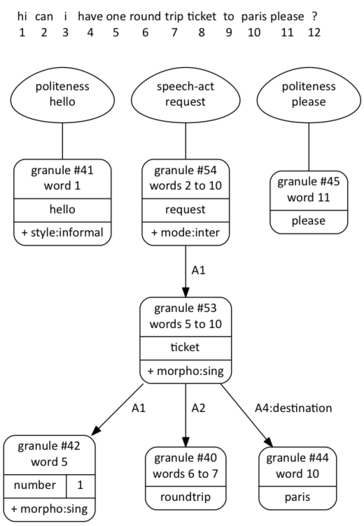
Figure 3: A structure of Granules
</center>

If this knowledge is well-defined (i.e. consistent and coherent), it can then be used for both understanding and generation. Thus, the system must be able to generate what it can understand, and conversely. To take benefit of this feature, all the granules must have at least one syntactic patterns with a **gen** attribute set to TRUE. The generation and the rephrase (partial or not) of an existing structure of granules is the job the YAGE module.

<a name="section3"></a>
## 3. The YASPML formalism<div style="float:right;">[](#Toc)</div>

The YASPML (YASP Modeling Language) is an XML formalism that allow you to describe a grammar for a specific dialogue application. The aim is not to describe all the subtlety of a natural language, but to allow a dialogue system to deal with natural language, taking account some aspects of its variability. YASPML is based on the Granule Model described above. This is the description of a standard granule:

<pre>
&lt;granule concept="<font color=blue>concept-ident</font>" offers="<font color=blue>set-of-features</font>">
    &lt;dependency id="<font color=blue>Ai</font>"
                role="<font color=blue>optional-role</font>"
                expected="<font color=blue>set-of-features</font>"    <font color=grey>(one at least and/or...)</font>
                required="<font color=blue>set-of-features</font>"    <font color=grey>(all of them and/or...)</font>
                rejected="<font color=blue>set-of-features</font>">   <font color=grey>(any of them)</font>
    ...
    &lt;syntax pattern="<font color=blue>regular-expression</font>" metadata="<font color=blue>set-of-metadata</font>">
    &lt;syntax pattern="<font color=blue>regular-expression</font>" metadata="<font color=blue>set-of-metadata</font>">
    ...
&lt;/granule>
</pre>

- The *concept-ident* can be a simple token, like `request`, or a composed ident (a list of tokens separated by colon characters), like `number:1`. This can be used by the YADE dialogue. For example, the value 1 can be extracted from `number:1`. This is also used to deal with dates. Use a composed ident only if you plan to extract parts of this ident.

- The *set-of-features* in the **offer** attribute contains the semantic features that describe the granule in regard to the task and to the dialogue. The name of the granule (or each parts of its composed name) will be automatically added to the offers. Thus, a name (or a part of name) can be used as a expected, required, or rejected feature. Every feature identifier must be separately declared like this:

	`<declare-feature="..."/>`

- Each dependency is identified by a code **Ai** but it can also be characterized by a **role** that the child granule will endorse within a G-structure, like explained above. Every role identifier must be separately declared like this:

	`<declare-role="..."/>`

- The *set-of-features* in the following attributes are used to enable the feature-matching between the granule and its potential children:

	- At least one feature is required to satisfy the **expected** attribute;
	- All the features are required to satisfy the **required** attribute;
	- Any of the **rejected** features must appear in the child's offers.
	
	In the general case, at least one of these attributes must be filling. In special cases, that can be substituted by a [boolean constraint](#section33).

<a name="patterns"></a>

- A *regular-expression* is composed of terminal terms and non-terminal terms. This defines a reversible, context-free, semantic grammar. You can also specifies alternatives, optional terms, and lemmatized forms:

| &nbsp; | Type of terms       | Syntax / Example        | Remarque
|:------:|:--------------------|:------------------------|:------------
| 1      | Constant words      | `... can I have ...`    |
| 2      | Optional words      | `... tv (set) ...`      | combinable with 5, 6, 7, 8
| 3      | Dependency IDREFs   | `... A1 ticket ...`     |
| 4      | Optional IDREFs     | `... (A1) ticket ...`   |
| 5      | Optional characters | `... child(ren) ...`    |
| 6      | Open terminaison    | `... child+ ...`        |
| 7      | Word alternative    | `... tv/television ...` | combinable with 5, 6, 8
| 8      | Lemmatized form     | `... [vouloir] ...`     | for French and for English

- It is also possible to specify metadata for each pattern, in order to characterize different ways of speaking (morphology, modality, style or level of language, etc.). Like the features and the roles, the metadata must be separately declared:

	`<declare-metadata="..."/>`

This is the complete Document Type Definition (DTD) of the YASPML language:

```
<!ENTITY % typecode "(A1|A2|A3|A4|A5|A6|A7|A8|A9)" >
<!ENTITY % typegram "(NOM|NOUN|GN|GV|NP|VP|NONE) 'NONE'" >
<!ENTITY % typebool "(TRUE|FALSE) 'FALSE'" >
<!ENTITY % typerole "IDREF 'nil'" >

<!ELEMENT granules (feature|metadata|role|granule)* >

<!ELEMENT feature EMPTY >
<!ATTLIST feature name ID #REQUIRED >

<!ELEMENT metadata EMPTY >
<!ATTLIST metadata name ID #REQUIRED >

<!ELEMENT role EMPTY >
<!ATTLIST role name ID #REQUIRED >

<!ELEMENT granule (dependency*, constraint*, syntax+) >
<!ATTLIST granule
    concept ID #IMPLIED
    offers IDREFS #IMPLIED
    offerexpr CDATA #IMPLIED >

<!ELEMENT dependency EMPTY >
<!ATTLIST dependency
    expected IDREFS #IMPLIED
    required IDREFS #IMPLIED
    rejected IDREFS #IMPLIED
    code %typecode; #REQUIRED
    role %typerole;
    flex %typebool;
    mult %typebool;
    tag  %typegram; >

<!ELEMENT constraint EMPTY >
<!ATTLIST constraint test CDATA #IMPLIED >

<!ELEMENT syntax EMPTY >
<!ATTLIST syntax
    pattern CDATA #IMPLIED
    example CDATA #IMPLIED
    metadata IDREFS #IMPLIED
    gen %typebool; >
```

YASPML comes also with some advanced features that can be used in particular cases:

<a name="section31"></a>
### 3.1 Flexible dependencies<div style="float:right;">[](#Toc)</div>

The general method for parsing consists in combining syntactic constraints (based on pattern-matching) and semantic constraints (based on feature-matching). In certain cases, it could be useful to bypass the syntactic constraints. Thus, a free (unconnected) granule can be "saved" by using only the feature-matching with a close granule. This is the aim of flexible dependencies. If there are several applicants, the nearest one is chosen.

The following granule definition [room] contains a flexible dependency A2 that allows to connect (to rescue) free granules of type *room-feature*, without requiring any syntactic structure. That's why A2 does not need to appear in a syntactic pattern:

<pre>
&lt;granule concept="room" offers="requestable">
    &lt;dependency id="A1" expected="quantity"/>
    &lt;dependency id="A2" expected="room-feature" role="constraint" <font color=red>flex="TRUE"</font>/>
    &lt;syntax pattern="(A1) room(s)"/>
&lt;/granule>

&lt;granule concept="television" offers="object room-feature">
    &lt;syntax pattern="a/the television"/>
    &lt;syntax pattern="a/the TV (set)"/>
&lt;/granule>
</pre>

The following G-structure represents the utterance: *"I would like a room with a TV"*. The granule [television] was "rescued" thank to the flexible dependency of the [room] granule. This is represented by a dotted edge. The role *constraint* isn't necessary, but it provide a better understanding of the structure.

<center>

Figure 4: A flexible dependency
</center>

<a name="section32"></a>
### 3.2 Multiple dependencies<div style="float:right;">[](#Toc)</div>

The multiple dependencies are a generalization of the flexible dependencies. The aim is to allow several granules to be connected via only one dependency. This is useful in the case where you want to collect a list of granules (objects, properties, informations, etc.) but you don't know how many. This is an example of a multiple dependency:

<pre>
&lt;granule concept="room" offers="requestable">
    &lt;dependency id="A1" expected="quantity"/>
    &lt;dependency id="A2" expected="room-feature" role="constraint" <font color=red>mult="TRUE"</font>/>
    &lt;syntax pattern="(A1) room(s)"/>
&lt;/granule>

&lt;granule concept="television" offers="object room-feature">
    &lt;syntax pattern="a/the television"/>
    &lt;syntax pattern="a/the TV (set)"/>
&lt;/granule>

&lt;granule concept="jacuzzi" offers="room-feature">
    &lt;syntax pattern="a jacuzzi"/>
&lt;/granule>
</pre>

In the following G-structure, that represents the phrase *"a room with a TV and a jacuzzi"*, the two granules [television] and [jacuzzi] are both connected to the dependency A2 of the granule [room]:

<center>

Figure 5: A multiple dependency
</center>

<a name="section33"></a>
### 3.3 Boolean constraints<div style="float:right;">[](#Toc)</div>

The `<constraint test="..."/>` lines allows you to specify boolean constraints by using the [CLIPS](http://clipsrules.sourceforge.net/OnlineDocs.html) syntax (in red). This is useful in order to define specific grammatical structures, like the coordinating conjunction "and" for example. In this specific case, the two granules must have at least one common feature. This is defined by specifying a cross-constraint:

<pre>
&lt;granule concept="addition" offerexpr="<font color=red>(intersection ?offersA1 ?offersA2)</font>">
	&lt;dependency id="A1"/>
	&lt;dependency id="A2"/>
	&lt;constraint test="<font color=red>(intersectp ?offersA1 ?offersA2)</font>"/>
	&lt;syntax pattern="A1 and A2" gen="TRUE"/>
&lt;/granule>
</pre>

The two variables `?offersA1` and `?offersA2` are automatically defined when the dependencies A1 and A2 are verified. So, in this case, the element `<constraint test="..."/>` requires a non empty intersection between ?offersA1 and ?offersA2. The G-structure in Figure 6 corresponds to the phrase *"a room with a TV and a jacuzzi"* where [television] and [jacuzzi] share the feature *room-feature*. This is an alternative to the representation in Figure 5.

<center>
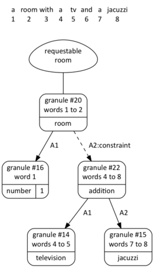
Figure 6: A coordinating conjunction
</center>

On the contrary, the interpretation of the phrase *"Paris and a ticket"* doesn't produce any granule [addition], because the granules [paris] and [ticket] have no feature in common.

<a name="section34"></a>
### 3.4 Calculated offers<div style="float:right;">[](#Toc)</div>

The G-structure in Figure 7 represents just the phrase *"a TV and a jacuzzi"*. The offers of the granule #6 are *addition* and *room-feature*. First, any granule always offers its name, that's the reason why *addition* is an offer of [addition]. It interesting to note that the feature *room-feature* was copied up from its children. This is the effect of the `offerexpr="..."` attribute, that contains a CLIPS expression. In this case, the result is the intersection between ?offersA1 and ?offersA2. That's why [addition] was connected to [room] as a *room-feature* in Figure 6.

<center>
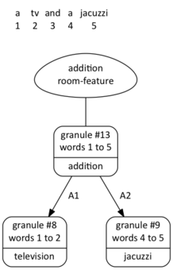
Figure 7: Calculated offers of a coordinating conjunction
</center>

<a name="section35"></a>
### 3.5 Transferred offers<div style="float:right;">[](#Toc)</div>

It is also possible to transfer offers from one (or more) dependency to the granule-father. Simply add the code of the dependency to the list of offers. The following definitions contain a method to define definite and indefinite pronouns, in order to deal with phrase that containing references

<pre>
&lt;granule concept="<font color=blue>reference</font>:this" offers="<font color=red>A1</font>">
	&lt;dependency id="<font color=red>A1</font>" expected="requestable" <font color=blue>rejected="reference"</font> role="referenced"/>
	&lt;syntax pattern="this one" metadata="morpho:sing"/>
	&lt;syntax pattern="this A1" metadata="morpho:sing"/>
	&lt;syntax pattern="these A1" metadata="morpho:plu"/>
&lt;/granule>

&lt;granule concept="<font color=blue>reference</font>:other" offers="<font color=red>A1</font>">
	&lt;dependency id="<font color=red>A1</font>" expected="requestable" <font color=blue>rejected="reference"</font> role="referenced"/>
	&lt;syntax pattern="the other one" metadata="morpho:definite morpho:sing"/>
	&lt;syntax pattern="the other A1" metadata="morpho:definite morpho:sing"/>
	&lt;syntax pattern="another A1" metadata="morpho:indefinite morpho:sing"/>
	&lt;syntax pattern="something else" metadata="morpho:indefinite morpho:sing"/>
&lt;/granule>

&lt;granule concept="request" offers="speech-act">
    &lt;dependency id="A1" expected="object requestable <font color=blue>reference</font>"/>
    &lt;syntax pattern="I want (A1)"/>
&lt;/granule>
</pre>

The rejected features *reference* (in blue) are not necessary, but it can prevent a reference to take another reference as a child. In contrary, it is useful to add *reference* as an expected feature of [request] in order to deal with the utterance *"I want this one"*.

Here are the G-structures corresponding to the following phrases:

- *a room*
- *this one*
- *this room*
- *the other room*
- *another room*

The offers of the granules [reference:other] contains *requestable* and *room* that are transferred from the granule [room]. The information definite / indefinite is indicated as a morphological metadata:

<center>
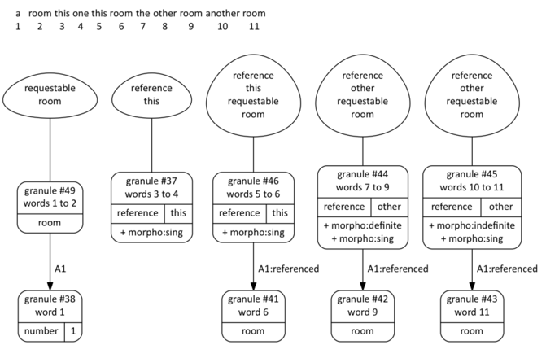
Figure 8: Examples of definite and indefinite references
</center>

<a name="section36"></a>
### 3.6 Interrogative and negative forms<div style="float:right;">[](#Toc)</div>

The fastest way to deal with interrogative and negative utterances is to take advantage of the metadata. Thus, interrogation and negation are just a way of talking about a concept, but not a concept:

<pre>
&lt;granule concept="request" offers="speech-act">
    &lt;dependency id="A1" expected="object requestable reference"/>
    &lt;syntax pattern="I want (A1)"/>
    &lt;syntax pattern="I would like (A1)"/>
    &lt;syntax pattern="can I have (A1)" <font color=red>metadata="mode:inter"</font>/>
    &lt;syntax pattern="I do not want (A1)" <font color=red>metadata="mode:neg"</font>/>
    &lt;syntax pattern="I don' t want (A1)" <font color=red>metadata="mode:neg"</font>/>
&lt;/granule>
</pre>

Here are the G-structures corresponding to the following utterances:

- *I want this one*
- *I want this room*
- *Can I have this room?*
- *I don't want this room*

<center>
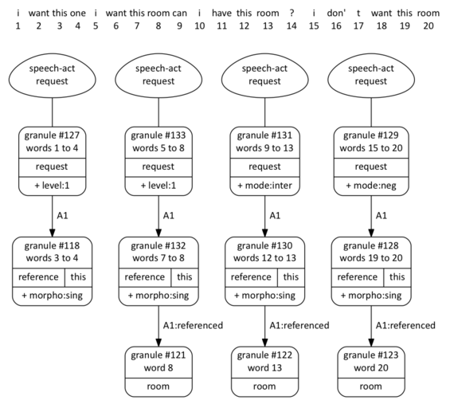
Figure 9: Example of interrogative and negative forms
</center>

<a name="section4"></a>
## 4. The YASP understanding module<div style="float:right;">[](#Toc)</div>

The YASP module builds hierarchical structures of granules, directly from the user inputs, without any pre-segmentation or POS tagging. The parsing algorithm is based on a double principle of pattern matching and feature matching. An efficient forward chaining inference engine controls everything. YASP builds and stores partial interpretations, even if they are in competition. Then, it applies a conflict resolution strategy based on the number of words caught by the syntactic patterns. Finally, it tries to link unattached structures, only on the basis of feature matching. In this case, such granules become **rescued**. The output of the YASP server is an XML structure where each instantiated granule has the following attributes:

In certain cases, YASP can infer some granules, even if no syntactic pattern is recognized. Such granules are called **inferred**.

- An attribute **id** that gives the unique identifier of the granule;
- An attribute **name** that gives the name of the granule;
- An attribute **offers** that contains the offered features of the granule;
- An attribute **metadata** that contains the metadata of the used pattern;
- An attribute **text** that gives the recognized segment in the utterance;
- Two attributes **pos** and **end** that give the position of the segment;
- An attribute **score** that gives the calculated score of the granule;
- A boolean attribute **root** that indicates if the granule is a root;
- A boolean attribute **rescued** that indicates if the granule was rescued;
- A boolean attribute **inferred** that indicates if the granule was inferred;

If the granule is a child, the following attributes are significant:

- An attribute **code** that gives the identifier of the dependency;
- An attribute **role** that gives the given role of the child in the structure;
- An attribute **retained** that contains the retained features during the connection;

The following XML structure corresponds to the parsing of the utterance: *"Hi, can I have one round-trip ticket to Paris please?"*. The YADTK toolkit comes with a graphical visualization tool that can produce graphical representations like those of Figures 3. Such outputs can be used as such, or reinjected into the YADE dialogue module.

```
<structure text="hi can i have one round trip ticket to paris please ?">
   <granule id="3" concept="hello" code="nil" role="nil" offers="politeness hello" retained="" metadata="style:informal" text="hi" pos="1" end="1" root="TRUE" inferred="FALSE" rescued="FALSE" score="1"/>
   <granule id="16" concept="request" code="nil" role="nil" offers="speech-act request" retained="" metadata="level:3 mode:inter" text="can i have one round trip ticket to paris" pos="2" end="10" root="TRUE" inferred="FALSE" rescued="FALSE" score="9">
      <granule id="15" concept="ticket" code="A1" role="nil" offers="object requestable ticket" retained="object requestable" metadata="" text="one round trip ticket to paris" pos="5" end="10" root="FALSE" inferred="FALSE" rescued="FALSE" score="6">
         <granule id="4" concept="number:1" code="A1" role="nil" offers="number quantity number 1" retained="quantity" metadata="" text="one" pos="5" end="5" root="FALSE" inferred="FALSE" rescued="FALSE" score="1"/>
         <granule id="2" concept="roundtrip" code="A2" role="nil" offers="ticket-property roundtrip" retained="ticket-property" metadata="" text="round trip" pos="6" end="7" root="FALSE" inferred="FALSE" rescued="FALSE" score="2"/>
         <granule id="6" concept="paris" code="A4" role="destination" offers="place city station paris" retained="station" metadata="" text="paris" pos="10" end="10" root="FALSE" inferred="FALSE" rescued="FALSE" score="1"/>
      </granule>
   </granule>
   <granule id="7" concept="please" code="nil" role="nil" offers="politeness please" retained="" metadata="" text="please" pos="11" end="11" root="TRUE" inferred="FALSE" rescued="FALSE" score="1"/>
</structure>
```

YASP is able to deal with rather complex sentences. For example, the structure of granules in the following figure represents the utterance: *"Hello, can I have a room for five people, two couples and one child, from the twentieth to the twenty first of february in Marseille, and the following two nights in Avignon?"*

<center>
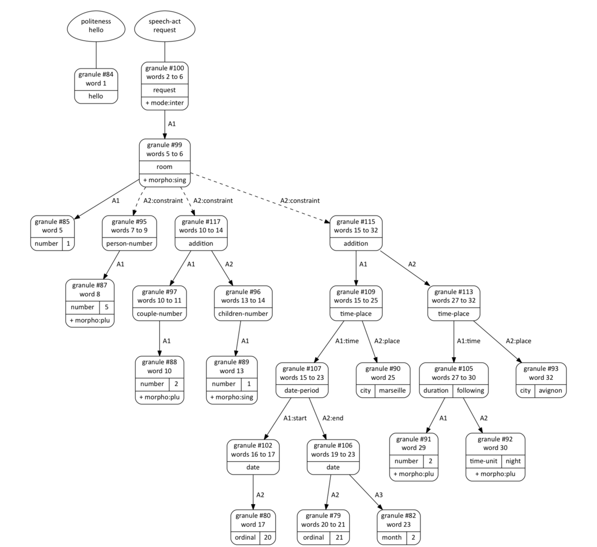
Figure 10: Example of a more complex utterance
</center>

Considering this result, we can see that the substructure <font color=blue>[duration:following [number:2] [time-unit:night]]</font> resulting from the phrase *"the following two nights"* can be substituted with the structure <font color=blue>[date-period [date [ordinal:22] [month:2]] [date [ordinal:23] [month:2]]]</font>. This kind of inference on structures of granules is fully implemented and integrated into the YADE module.

### *Let's have a look to the trace...*

The parsing process can be explored through its trace, that allow us to understand how a structure of granules was builded, or to debug a grammar. You can see below an example of a trace from YASP. The newly instantiated granules are preceded by `==>` and those that are deleted are preceded by `<==`. Certain granules are deleted during the step 1. Some remaining conflicts can be resolved during the step 3.

```
Waiting for a connection...
Connection from xxx.xxx.xxx.xxx
Received [Can I have a ticket to Paris please ?]
--------------------------------------------------------------------------------
STEP 1 - Granule instantiation
--------------------------------------------------------------------------------
==> [request]#1 (can i have) pattern="can I have/obtain" offers=(speech-act request) metadata=(level:3 mode:inter) granules=() pos=(1 2 3) ins=() score=3.000000
==> [number:1]#2 (a) pattern="a" offers=(number quantity number 1) metadata=() granules=() pos=(4) ins=() score=1.000000
==> [ticket]#3 (ticket) pattern="ticket" offers=(object requestable ticket) metadata=(morpho:sing) granules=() pos=(5) ins=() score=1.000000
==> [paris]#4 (paris) pattern="paris" offers=(place city station paris) metadata=() granules=() pos=(7) ins=() score=1.000000
==> [please]#5 (please) pattern="please" offers=(politeness please) metadata=() granules=() pos=(8) ins=() score=1.000000
==> [request]#6 (can i have ticket) pattern="can I have/obtain A1" offers=(speech-act request) metadata=(level:3 mode:inter) granules=([ticket]#3) pos=(1 2 3 5) ins=(4) score=3.000000
==> [ticket]#7 (ticket to paris) pattern="ticket(s) to A4" offers=(object requestable ticket) metadata=() granules=([paris]#4) pos=(5 6 7) ins=() score=3.000000
==> [request]#8 (can i have ticket to paris) pattern="can I have/obtain A1" offers=(speech-act request) metadata=(level:3 mode:inter) granules=([ticket]#7) pos=(1 2 3 5 6 7) ins=(4) score=5.000000
<== [request]#1 (can i have) for the benefit of [request]#8 (can i have ticket to paris) / score
<== [request]#6 (can i have ticket) for the benefit of [request]#8 (can i have ticket to paris) / score
==> [ticket]#9 (a ticket) pattern="A1 ticket" offers=(object requestable ticket) metadata=(morpho:sing) granules=([number:1]#2) pos=(4 5) ins=() score=2.000000
<== [ticket]#3 (ticket) for the benefit of [ticket]#9 (a ticket) / score
==> [request]#10 (can i have a ticket) pattern="can I have/obtain A1" offers=(speech-act request) metadata=(level:3 mode:inter) granules=([ticket]#9) pos=(1 2 3 4 5) ins=() score=5.000000
==> [ticket]#11 (a ticket to paris) pattern="A1 ticket(s) to A4" offers=(object requestable ticket) metadata=() granules=([number:1]#2 [paris]#4) pos=(4 5 6 7) ins=() score=4.000000
==> [request]#12 (can i have a ticket to paris) pattern="can I have/obtain A1" offers=(speech-act request) metadata=(level:3 mode:inter) granules=([ticket]#11) pos=(1 2 3 4 5 6 7) ins=() score=7.000000
<== [request]#8 (can i have ticket to paris) for the benefit of [request]#12 (can i have a ticket to paris) / score
<== [request]#10 (can i have a ticket) for the benefit of [request]#12 (can i have a ticket to paris) / score
<== [ticket]#9 (a ticket) for the benefit of [ticket]#7 (ticket to paris) / score
--------------------------------------------------------------------------------
STEP 2 - Hypothesis generation
--------------------------------------------------------------------------------
--------------------------------------------------------------------------------
STEP 3 - Conflict resolution
--------------------------------------------------------------------------------
<== [ticket]#7 (ticket to paris) for the benefit of [request]#12 (can i have a ticket to paris) / score
--------------------------------------------------------------------------------
STEP 4 - Free granules rescuing
--------------------------------------------------------------------------------
--------------------------------------------------------------------------------
STEP 5 - Finalization
--------------------------------------------------------------------------------
+++ Root [request]#12 offers=(speech-act request)
+++ Root [please]#5 offers=(politeness please)
--------------------------------------------------------------------------------
Resulting structure of granules
--------------------------------------------------------------------------------
[request]#12 (can i have a ticket to paris) offers=(speech-act request) metadata=(level:3 mode:inter) pos=(1 2 3 4 5 6 7) nbins=0 score=7.000000
   A1:[ticket]#11 (a ticket to paris) offers=(object requestable ticket) retained=(object requestable) pos=(4 5 6 7) nbins=0 score=4.000000
      A1:[number:1]#2 (a) offers=(number quantity number 1) retained=(quantity) pos=(4) nbins=0 score=1.000000
      A4:[paris]#4 (paris) offers=(place city station paris) retained=(station) role=destination pos=(7) nbins=0 score=1.000000
[please]#5 (please) offers=(politeness please) pos=(8) nbins=0 score=1.000000
================================================================================
Waiting for a connection...
```

<a name="section41"></a>
### 4.1 Dealing with redundancies<div style="float:right;">[](#Toc)</div>

To some extent, YASP can absorb redundancies in a utterance. This is possible thanks to a **merging mechanism** which searches for redundancies into the G-structures that come from the YASP parser. For example, the utterance: *"I want ... I want a ticket to Paris ... yes, that's it, a ticket to Paris"* is firstly represented as shown on the left in Figure 11, then, the structures are merged as shown on the right. As the merging algorithm tries to keep the older granules, the granule [request]#1 was preserved during the merging of [request]#1 and [request]#17. Here are the trace of the inferences and the graphical representation. The deleted granules are drawn in grey:

```
### Merging of [ticket]#15 and [ticket]#16 (the latter is preserved)
<== [ticket]#15
<== [number:1]#6
<== [paris]#8
### Merging of [request]#17 and [request]#1 (the latter is preserved)
<== [request]#17
```

<center>

Figure 11: Example of a merging of three G-structures
</center>

<a name="section42"></a>
### 4.2 Dealing with ambiguities<div style="float:right;">[](#Toc)</div>

YASP is able to solve some ambiguities, if the context permits. For example in French, the word AVOCAT is an avocado or a lawyer. So the utterance *"Je veux un avocat"* means *"I want an avocado"* or *"I want a lawyer"*. But if you say *"Je veux un avocat compétent"*, it is clear that you want a (competent) lawyer. Similarly, if you say *"Je veux un avocat bien mûr"*, it is clear that you want a (well ripe) avocado.

YASP tries to solve ambiguities by the use of the mechanism of offers and expectations. In this example, the granule [personne:avocat] expects a granule which offers a human feature, and the granule [fruit:avocat] expects a granule which offers a characteristic of an edible. If YASP can’t disambiguate, the conflict is indicated in the G-structure, and this is a task for the dialogue manager:

<pre>
&lt;structure text="un avocat">
	<font color="red">&lt;conflict id1="137" id2="138"/></font>
	&lt;granule id="137" concept="fruit:avocat" code="nil" role="nil" offers="comestible demandable enumerable fruit avocat" retained="" metadata="morpho:masc morpho:sing" text="un avocat" cov="2" pos="1" fin="2" root="TRUE" inferred="FALSE" rescued="FALSE" score="2">
		&lt;granule id="125" concept="nombre:1" code="A1" role="nil" offers="nombre quantite" retained="nombre" metadata="morpho:masc morpho:sing" text="un" cov="1" pos="1" fin="1" root="FALSE" inferred="FALSE" rescued="FALSE" score="1"/>
	&lt;/granule>
	&lt;granule id="138" concept="personne:avocat" code="nil" role="nil" offers="demandable enumerable personne avocat" retained="" metadata="" text="un avocat" cov="2" pos="1" fin="2" root="TRUE" inferred="FALSE" rescued="FALSE" score="2">
		&lt;granule id="125" concept="nombre:1" code="A1" role="nil" offers="nombre quantite" retained="nombre" metadata="morpho:masc morpho:sing" text="un" cov="1" pos="1" fin="1" root="FALSE" inferred="FALSE" rescued="FALSE" score="1"/>
	&lt;/granule>
&lt;/structure> 
</pre>

<center>

Figure 12: Resolutions of an "academic" ambiguity in French
</center>

```
<granule concept="fruit:avocat" offers="comestible demandable enumerable">
	<dependency id="A1" expected="nombre"/>
	<dependency id="A2" expected="etat"/>
	<syntax pattern="(A1) avocat (A2)" metadata="morpho:masc morpho:sing"/>
	<syntax pattern="(A1) avocats (A2)" metadata="morpho:masc morpho:plu"/>
</granule>

<granule concept="personne:avocat" offers="demandable enumerable">
	<dependency id="A1" expected="nombre"/>
	<dependency id="A2" expected="valeur"/>
	<syntax pattern="(A1) avocat(s) (A2)"/>
</granule>

<granule concept="mur" offers="etat">
	<syntax pattern="(bien) mûr"/>
</granule>

<granule concept="competent" offers="valeur">
	<syntax pattern="(très) compétent"/>
</granule>
```

<a name="section43"></a>
### 4.3 The Granule Guesser<div style="float:right;">[](#Toc)</div>

For certain applications, like information searching in open domain, we may need to identify some parts of utterances without having corresponding lexical data. This is the role of the Granule Guesser. For example, the phrase *"the color of the black snow"* can be interpreted without any granule definition for *"the black snow"*. Indeed, the Granule Guesser can identify *"the black snow"* as a potential actant A2 of the granule [attribution], as long as there is enough information:

- A POS tagging that can identify *"the black snow"* as a nominal phrase (NP);
- A pattern for [attribution] in which it is specified that the A2 actant can be guessed:

<pre>
&lt;granule concept="color" offers="property">
    &lt;syntax pattern="color"/>
&lt;/granule>

&lt;granule concept="attribution">
	&lt;dependency id="A1" expected="property"/>
	&lt;dependency id="A2" expected="object" <font color="red">tag="NP"</font>/>
    &lt;syntax pattern="the A1 of A2"/>
&lt;/granule>

&lt;granule concept="definition">
	&lt;dependency id="A1" expected="attribution"/>
	&lt;dependency id="A2" expected="definition" <font color="red">tag="NP"</font>/>
    &lt;syntax pattern="A1 is A2"/>
    &lt;syntax pattern="is A1 A2" metadata="mode:inter"/>
&lt;/granule>
</pre>

In the following example, neither *"the black snow"* nor *"an oxymoron"* are known by YASP. However, the utterance *"is the color of the black snow an oxymoron?"* is well-interpreted, thanks to the Granule Guesser and the preceding YASP definitions. The guessed Granules are represented with a dotted line:

<center>

Figure 13: Example of a "Granule Guessing"
</center>

To enable the Granule Guesser, edit the attributes `tagger` and `lang` in the file `configurations.xml`:

<pre>
&lt;server-yasp position="500+030" port="12345" trace="TRUE" debug="FALSE" leven="FALSE" <font color="red">tagger="TRUE" lang="en"</font>/>
</pre>

> *The Granule Guesser is proposed for French `lang="fr"` and for English `lang="en"` for now. It is based on a non deterministic POS tagger that uses morphological resources.*

<a name="section44"></a>
### 4.4 Non-Regression Testing<div style="float:right;">[](#Toc)</div>

A classic problem that can occur while building rule-based grammars is the regression. Non-regression tests (NRT) are performed to test that adding or changing a rule has had the desired effect, and above all, to check that what worked before still works. In order to avoid regression, YADTK comes with NRT scripts. To proceed to an understanding NRT, run a configuration that uses the `yaspclient_nrt.py` client:

```
<config id="demo_yasp_nrt" knowledge="TEST_FR">
	<server-yasp position="500+030" port="12345" trace="TRUE" debug="FALSE" leven="FALSE" tagger="TRUE" lang="fr"/>
	<client-yasp position="500+400" script="yaspclient_nrt.py" input="APPLICATIONS/TEST_FR/data/yasp_nrt.xml"/>
</config>
```

The basic methodology to proceed to NRT is the following:

1. Take an utterance from your corpus;
2. Submit it to YASP and examine the produced structure;
3. Modify the knowledge to produce a satisfactory structure (repeat step 2);
4. Add the XML structure to the NRT file (`yasp_nrt.xml` in this example);
5. Start the NRT;
6. If it's OK, go to step 1;
7. Otherwise, repeat step 3.

If an error occurs, the script stops and shows the error:

<center>

Figure 14: A granule error
</center>

<center>
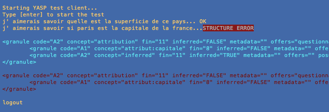
Figure 15: A structure error
</center>

<a name="section45"></a>
### 4.5 Batched parsing<div style="float:right;">[](#Toc)</div>

The YASP Client for batched parsing is useful to parse big corpora with a YASPML grammar. This is a batched parsing configuration for the input file `media.txt` with the MEDIA knowledge:

```
<config id="media" knowledge="MEDIA">
	<server-yasp position="500+030" port="12345" trace="TRUE" debug="FALSE" leven="FALSE" tagger="TRUE" lang="fr"/>
	<client-yasp position="500+400" script="yaspclient_batch.py" input="/absolute-path-to-file/media.txt" pdf="TRUE"/>
</config>
```

The result is composed of three files:

- `media_results.xml` => contains the G-structures for all lines of the input file in the XML format.
- `media_results.pdf` => contains the graphical representation of all the G-structures.
- `media_results.stats` => contains some statistics concerning the parsing.

This is a screencast of the YASP server in action and its batch client. This shows the average speed of YASP to build a structure of Granules. This speed is proportional to the length of the utterances:

<center>
	<object type="application/x-shockwave-flash" data="video_batch.swf" width="800" height="733">
		<param name="movie" value="video_batch.swf"/>
		<param name="quality" value="high"/>
	</object>
</center>

<a name="section5"></a>
## 5. The YAGE generation module<div style="float:right;">[](#Toc)</div>

As said previously, the YAGE generation module can generate a characters string from a granule structure already present in the YADE working memory, or described as an XML literal description. To be sure that the system is able to generate all what it can understand, all the granules must have at least one syntactic patterns with a **gen** attribute set to TRUE. The patterns that you want be used for generation must have neither alternatives terms, like `a/an` nor optional character, like `ticket(s)`. However, it is possible to use optional terms, like `(very)` or `(A1)`.

The generation algorithm uses metadata in order to select the most suitable pattern. The principle is to maximize the length of the pattern and the number of common metadata between a granule and its sons (local constraints). It is also possible to influence the generation process by specifying  global constraints. The latter are also specified by metadata. Thus, it is possible to set a dialogue style, as long as there are enough  patterns for generation.

Let's have a look to the grammar in the frame below:

<pre>
&lt;granule concept="ticket" offers="object requestable">
    &lt;dependency id="A1" expected="quantity"/>
    &lt;dependency id="A2" expected="ticket-property"/>
    &lt;dependency id="A3" expected="station" role="departure"/>
    &lt;dependency id="A4" expected="station" role="destination"/>
    &lt;syntax pattern="(A1) (A2) ticket" <font color="red">metadata="morpho:sing" gen="TRUE"</font>/>
    &lt;syntax pattern="(A1) (A2) tickets" <font color="red">metadata="morpho:plu" gen="TRUE"</font>/>
    &lt;syntax pattern="(A1) (A2) ticket to A4" <font color="red">metadata="morpho:sing" gen="TRUE"</font>/>
    &lt;syntax pattern="(A1) (A2) tickets to A4" <font color="red">metadata="morpho:plu" gen="TRUE"</font>/>
&lt;/granule>

&lt;granule concept="number:1" offers="number quantity">
    &lt;syntax pattern="1"/>
    &lt;syntax pattern="one" <font color="red">metadata="morpho:sing" gen="TRUE"</font>/>
&lt;/granule>

&lt;granule concept="number:2" offers="number quantity">
    &lt;syntax pattern="2"/>
    &lt;syntax pattern="two" <font color="red">metadata="morpho:plu" gen="TRUE"</font>/>
&lt;/granule>

&lt;granule concept="roundtrip" offers="ticket-property">
    &lt;syntax pattern="round trip" <font color="red">gen="TRUE"</font>/>
&lt;/granule>

&lt;granule concept="paris" offers="place city station">
    &lt;syntax pattern="paris" <font color="red">gen="TRUE"</font>/>
    &lt;syntax pattern="panam" <font color="red">metadata="style:slangy" gen="TRUE"</font>/>
&lt;/granule>
</pre>

It is possible to test the generation possibilities by the use of the YAGE client, by passing a literal G-structure (described in XML) to the YAGE server. For example, the following G-structures produce respectively the phrases: *"one round trip ticket to paris"* and *"two round trip tickets to panam"*. Here, we can observe the effects of the morphological and stylistic constraints:

<pre>
&lt;granule concept="ticket">
	&lt;granule concept="number:1"/>
	&lt;granule concept="roundtrip"/>
	&lt;granule concept="paris" role="destination"/>
&lt;/granule>

<font color="blue">>>> one round trip ticket to paris</font>

&lt;granule concept="ticket">
	&lt;granule concept="number:2"/>
	&lt;granule concept="roundtrip"/>
	&lt;granule concept="paris" role="destination" <font color="red">metadata="style:slangy"</font>/>
&lt;/granule>

<font color="blue">>>> two round trip tickets to panam</font>
</pre>

In this example, morphological metadata are used to make agreements in gender and number, whereas the stylistic one is used as an extern constraint. In both cases, it is to make a choice between several syntactic patterns.

<a name="section6"></a>
## 6. The YADE dialogue controller<div style="float:right;">[](#Toc)</div>

As our goal is to propose a highly programmable tool, our choice was to minimize the number of built-in dialogue strategies, in order to allow programmers to develop their own strategies. In contrast, we are providing a rule-based language called YADEML, to deal with the G-structures produced by the YASP semantic parser. Actually, YADEML is used to describe **inference rules** and **dialogue rules**. What differentiates them is mainly situated in their consequences (actions part), that contain or not an answer of the system. This is described in section 7.

The dialogue controller plays a central role in a dialogue system. In particular, it is responsible of **maintaining the coherence** (locally and overall) into the conversation. Dialogue controllers are often based on an **waiting principle** that contributes to maintain the coherence:

- Between the statements and the current task (global contexts);
- Between the initiative and the reactive statements (local contexts).

Several approaches can be developed to implements a waiting principle. Some controllers are based on a finite state machine. This provides robustness, but also too little flexibility in dialogue. Other controllers are based on explicit waitings, which requires to define a declarative waiting system.

<a name="section61"></a>
### 6.1 Structuration of the YADE working memory<div style="float:right;">[](#Toc)</div>

In our case, a global waiting context is defined by the G-structures that are into the working memory. The local waiting contexts are defined by **nested rules systems**. Actually, we will see that it is possible to define a rule into the context of another one; a nested rule can be fired only if its "mother rule" was recently fired. This mechanism is not similar to a finite state machine because the dialogue isn't really guided. This is only use to give firing contexts to some rules.

<center>

Figure 16: Example of two firing contexts
</center>

A standalone rule (SR) contains no nested rules, while an initiative rule (IR) contains nested rules (NR) and at least one nested terminal rules (NTR). An initiative rule can also be nested (NIR). When an initiative rule (IR or NIR) is fired, a new interpretation context is opened. The latter is closed as soon as a nested "terminal" rule (NTR) is fired. SR and IR can be fired in any context. In Figure 16, NTR1 is a nested rule of the initiative rule IR1. NR2 and NTR2 are nested rules of the initiative rule IR2. The latter isn't necessary a nested rule of IR1 (otherwise it would be called NIR1). Finally, SR is a standalone rule which was fired in context #1.

In summary, this is the typology of YADE rules:

- **SR** (standalone rules): can be fired anywhere;
- **IR** (initiative rules): can be fired anywhere + open a new context;
- **NR** (nested rules): can be fired only in a specific context;
- **NTR** (nested terminal rules): can be fired only in a specific context + close the current context;
- **NIR** (nested initiative rules): can be fired only in a specific context + open a new context.

| &nbsp;  | can fire anywhere | opens a new context | closes the current context |
|:-------:|:-----:|:-----:|:-----:|
| **SR**  |  yes  |  no   |  no   |
| **IR**  |  yes  |  yes  |  no   |
| **NIR** |  no   |  yes  |  no   |
| **NTR** |  no   |  no   |  yes  |
| **NR**  |  no   |  no   |  no   |

### Obsolescence and deletion of granules:

As YADE manages a stack of interactional contexts, it is possible to define a mechanism of obsolescence for the granules, based on the contexts stack. Actually, all the granules that were instantiated in a closed context are considered as obsolete. However, they are not deleted from the working memory, they are just tagged as "obsolete", unless they are useful in regard to the current task. Anyway, there's also a mechanism of deletion for oldest obsolete granules.

<a name="section62"></a>
### 6.2 YADE in action<div style="float:right;">[](#Toc)</div>

This is a screencast of the YADE server in action with the Web Dialogue Client:

<center>
	<video controls>
  		<source src="video_nao.mp4" type="video/mp4">
  		Your browser does not support the video tag
	</video>
</center>

<a name="section63"></a>
### 6.3 Non-Regression Testing<div style="float:right;">[](#Toc)</div>

Like while building a YASPML grammar, you better proceed to non-regression tests (NRT) while building a YADEML grammar to check that what worked before still works. To proceed to a dialogue NRT, run a configuration that uses the `yadeclient_nrt.py` dialogue client:

```
<config id="demo_yade_nrt" knowledge="TEST_FR">
	<server-yasp position="500+030" port="12345" trace="TRUE" debug="FALSE" leven="FALSE" tagger="TRUE" lang="fr"/>
	<server-yage position="500+400" port="12346" trace="TRUE" debug="FALSE"/>
	<server-yade position="600+100" port="12347" trace="TRUE" debug="FALSE" mirror="FALSE"/>
	<client-yade position="600+470" script="yadeclient_nrt.py" input="APPLICATIONS/TEST_FR/data/yade_nrt.txt"/>
</config>
```

The format of a NRT file (`yade_nrt.txt in this example) must be the following:

```
USER: reset
YADE: xxxxx
USER: xxxxx
YADE: xxxxx
etc.
```

If an error occurs, the script stops and shows the error:

<center>
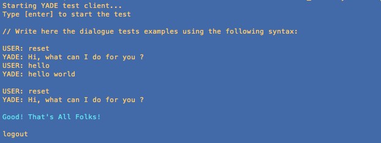
Figure 17: Successful dialogue NRT
</center>

<center>
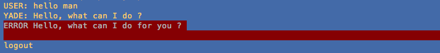
Figure 18: Unsuccessful dialogue NRT
</center>

<a name="section64"></a>
### 6.4 How to write I/O plugins<div style="float:right;">[](#Toc)</div>

The dialogue client works with I/O plugins: one for the input and one for the output. These plugins are selected through the configuration file. For exemple, the first following configuration works with the keyboard as input and the screen as output, and the second configuration works with the microphone as input and the speaker as output:

```
<client-yade position="600+470" script="yadeclient.py" visualization="TRUE">
	<input script="keyboard.py"/>
	<output script="text_only.py"/>
</client-yade>
```
```		
<client-yade position="600+470" script="yadeclient.py" visualization="TRUE">
	<input script="google_asr.py" lang="en-US"/>
	<output script="apple_tts.py" voice="Karen"/>
</client-yade>
```

To write an input (resp. output) plugin, you juste have to write a Python file that contain a function called `__input__()` (resp. `__output__(text)`) and to store it in the folder `YADTK/YADE_client/ioplugins`. For example, this is the code of the plugin `apple.tts.py`:

~~~python
import os
import re
import codecs

from xml.dom import minidom
xmldoc = minidom.parseString(OUTPUT_MODULE)
# Getting the XML attribute voice
VOICE = xmldoc.documentElement.getAttribute("voice")

def __output__(text):

    # Looking for a voice command tag
    res = re.search("\[voice:([A-Za-z]*)\]", text)
    if res: voice = res.group(1)
    else: voice = VOICE
        
    text = re.sub(r"\[.*\]","", text) # Removing all the command tags
    
    SAY = "say -v %s \"%s\"" % (voice, text.decode("utf-8"))   
    os.system(SAY.encode("utf-8"))
~~~

If you need to add a new XML attribute, think to modify the configuration DTD file `YADTK/COMMON/xml/configurations.dtd`.

<a name="section7"></a>
## 7. The YADEML formalism<div style="float:right;">[](#Toc)</div>

Typically, the LHS (left-hand-side) of a YADEML rule describes a structure of granules within an XML formalism. If this description matches a substructure of granules inside the working memory, the RHS (right-hand-side) can be triggered. This is the structure of a standard YADEML rule:

<pre>
&lt;rule descr="..." example="...">
	&lt;conditions>
		...
	&lt;/conditions>
	&lt;actions>
		...
	&lt;/actions>
	<font color = "blue"><i>Nested rules can be written here...</i></font>
&lt;/rule>
</pre>

A YADEML rule do not have any name. The **descr** attribute contains a simple description (that will appear in the traces) and the **example** attribute just allow you to write an example of utterance that fires the rule. The `<conditions>...</conditions>` part contains the preconditions of the rule. Generally, a precondition is a XML literal description of a structure of granules that must match with the G-structures into the working memory. 

For example, the following condition matches with a granule [date] that has a [calendar] child but no [month] child. The [date] granule is identified by a variable that can be used into the RHS:

```
<conditions>
	<granule concept="date" ident="?id">
		<granule concept="calendar"/>
		<no-granule concept="month"/>
	</granule>
</conditions>
```

It possible to filter a granule according to its name, its offers, its code, its role, its metadata, and if it's a root or not. It also possible to use variables into a granule's name, and to verify some boolean constraints into the LHS:

```
<conditions>
	<granule concept="date">
		<granule concept="calendar:?cal" ident="?id1"/>
		<granule concept="month:?month" ident="?id2"/>
	</granule>
	<verify test="(date-error ?cal ?month)"/>
</conditions>
```

Here, the **date-error** boolean function is defined by the user, with a CLIPS syntax:

```
(deffunction MAIN::date-error (?day ?month)
	(bind ?day (toNumber ?day))
	(bind ?month (toNumber ?month))
	(or
		(and (= ?month 1) (> ?day 31))
		(and (= ?month 2) (> ?day 28))
		(and (= ?month 3) (> ?day 31))
		(and (= ?month 4) (> ?day 30))
		...
```

It is important to know where a granule must be searched. That is specified by the **scope** attribute:

- In the current **indice** (corresponds to the last utterance): `scope="INDICE"`
- In the current **context** (corresponds to the current unclosed context): `scope="CONTEXT"`
- In the current **dialogue** (corresponds to the entire working memory): `scope="GLOBAL"`

The scope can be specified for all the granules: `<conditions scope="...">` and/or for each granule: `<granule scope="...">`. Moreover, there are mechanisms of inheritance and of overload. Without inheritance, the default scope for all granules is set to INDICE, that corresponds to the last utterance.

<a name="section71"></a>
### 7.1 Manipulating the G-structures<div style="float:right;">[](#Toc)</div>

The first use of YADEML rules is granules manipulation, that allow you to define inferences on the G-structures. The possible actions on granules are: deletion, creation, disconnection, reconnection, modification, cloning. The following example is the creation and the connection of a granule [month:xx] to an existing granule [date]. This uses the **get-current-month** user-function:

<pre>
&lt;rule descr="add the current month to an incomplete date" example="the ten">
	&lt;conditions>
		<font color="blue">&lt;granule concept="date" ident="?id">
			&lt;granule concept="calendar"/>
			&lt;nogranule concept="month"/>
		&lt;/granule></font>
	&lt;/conditions>
	&lt;actions>
		<font color="red">&lt;reuse-granule ident="?id">
			&lt;create-granule concept="month:(get-current-month)"/>
		&lt;/reuse-granule></font>
	&lt;/actions>
&lt;/rule>
</pre>

The second example is the replacement of a granule [tomorrow] by a [date] one:

<pre>
&lt;rule descr="replace tomorrow by the correct date" example="tomorrow">
	&lt;conditions>
		<font color="blue">&lt;granule concept="tomorrow" ident="?id"/></font>
	&lt;/conditions>
	&lt;actions>
		<font color="red">&lt;remplace-granule ident="?id">
			&lt;create-granule concept="date">
				&lt;create-granule concept="calendar:(+ (get-current-day) 1)"/>
				&lt;create-granule concept="month:(get-current-month)"/>
			&lt;/create-granule>
		&lt;/remplace-granule></font>
	&lt;/actions>
&lt;/rule>
</pre>

<a name="section72"></a>
### 7.2 Dealing with the user's utterances<div style="float:right;">[](#Toc)</div>

YADEML provides three different methods in order to deal with the user's utterances:

- **Substring detection:** very basic but can be useful in certain cases;
- **Pattern recognition:** same formalism than YASPML (regular expressions);
- **G-structure recognition:** the more powerful method (names, offers, roles, metadata, etc.);

Here are four examples of YADEML rules:

<pre>
&lt;rule descr="<font color="blue">substring detection</font>" example="Hello">
	&lt;conditions><font color="red">
		&lt;input contains="hello"/></font>
	&lt;/conditions>
	&lt;actions>
		&lt;speak text="Hello World"/>
	&lt;/actions>
&lt;/rule>

&lt;rule descr="<font color="blue">pattern recognition</font>" example="I am happy">
	&lt;conditions><font color="red">
		&lt;input pattern="i am (very) happy/glad"/></font>
	&lt;/conditions>
	&lt;actions>
		&lt;speak text="Fantastic, me too"/>
	&lt;/actions>
&lt;/rule>

&lt;rule descr="<font color="blue">structure recognition</font>" example="Can I have one ticket?">
	&lt;conditions><font color="red">
		&lt;granule concept="request">
			&lt;granule concept="ticket">
				&lt;granule concept="number:1"/>
				&lt;nogranule role="destination"/>
			&lt;/granule>
		&lt;/granule></font>
	&lt;/conditions>
	&lt;actions>
		&lt;speak text="Please give me your destination"/>
	&lt;/actions>
&lt;/rule>

&lt;rule descr="<font color="blue">metadata detection</font>" example="Asshole">
	&lt;conditions><font color="red">
		&lt;granule metadata="lang:vulgarity"/></font>
	&lt;/conditions>
	&lt;actions>
		&lt;speak text="I'm sorry but I can't accept your language"/>
		&lt;command expr="stop-dialogue"/>
	&lt;/actions>
&lt;/rule>
</pre>

<a name="section73"></a>
### 7.3 Generating the system's utterances<div style="float:right;">[](#Toc)</div>

YADEML offers three ways of describing the system’s answers:

- **String restitution:** very basic but perhaps the most popular way;
- **Granule rephrasing:** useful in order to discuss the user's utterances (thanks to YAGE server);
- **Literal generation:** complete generation from a XML description (thanks to YAGE server);

This three methods can be combined in one rule. Moreover, it is possible to build the system's utterances by parts, by the use of several rules. The final utterance will be build by concatenation of the parts.

In the case of a string restitution, some parts can be built by the use of user-functions, as in the following example, where the system inserts the result of `(get-current-time)` in its reply. Actually, all term in parenthesis is automatically evaluated:

<pre>
&lt;rule descr="tell the time" example="What time is it?">
	&lt;conditions>
		&lt;granule concept="ask-for">
			&lt;granule concept="time"/>
		&lt;/granule>
	&lt;/conditions>
	&lt;actions>
		&lt;speak text="<font color="blue">It is</font> <font color="red">(get-current-time)</font> <font color="blue">to my watch</font>"/>
	&lt;/actions>
&lt;/rule>
</pre>

In the following examples, the parts `(rephrase ?id)` will be replaced by complete rephrasings of the referenced granules:

<pre>
&lt;speak text="<font color="blue">So you are looking for</font> <font color="red">(rephrase ?id)</font> <font color="blue">, OK.</font>"/>
&lt;speak text="<font color="blue">Sorry, are you looking for</font> <font color="red">(rephrase ?id)</font> <font color="blue">?</font>"/>
&lt;speak text="<font color="blue">When do you want to go to</font> <font color="red">(rephrase ?id)</font> <font color="blue">?</font>"/>
</pre>

In the case of a granule rephrasing, it is possible to specify **metadata** (literal constants or variables) which will be passed to the YAGE generator, in order to influence the generation process: `(rephrase ?id meta1 meta2 ...)`.

As it is possible to add **post-conditions** for every action of a RHS, the system's reply can be also selected in the RHS of a rule. In the following example, the variable `?metadata` was linked in the LHS of the rule:

<pre>
&lt;actions>
	&lt;speak text="<font color="blue">Hello, what can I do for you ?</font>" <font color="red">test="(member lang:en ?metadata)"</font>/>
	&lt;speak text="<font color="blue">Ciao, cosa posso fare per te ?</font>" <font color="red">test="(member lang:it ?metadata)"</font>/>
	&lt;speak text="<font color="blue">Bonjour, que puis-je pour vous ?</font>" <font color="red">test="(member lang:fr ?metadata)"</font>/>
&lt;/actions>
</pre>

The third way to build system's utterances is to request a complete generation process starting from an XML literal description of a G-structure. The syntax for this is the following, as long as the used granules were well-defined for generation:

<pre>
&lt;actions>
	&lt;speak>
		<font color="blue">&lt;granule concept="giving">
			&lt;granule concept="ticket">
				&lt;granule concept="number:2"/>
				&lt;granule concept="paris" role="destination"/>
			&lt;/granule>
		&lt;/granule></font>
	&lt;/speak>
&lt;/actions>
</pre>

Finally, it is also possible to specify global metadata, as with the rephrasing method: just add a **metadata** attribute to the `<speak>` command: `<speak metadata="...">`.

<a name="section74"></a>
### 7.4 Example of a system of nested rules<div style="float:right;">[](#Toc)</div>

As said in section 6, it is possible to write nested rules in order to manage contexts of interpretation. The following system of rules contains one initiative rule (IR), that contains one nested non-terminal rule (NR) and two nested terminal rules (NTR). This exemple shows how to manipulate the G-structures while dialoguing:

<pre>
<font color="red">&lt;!-- Initiative Rule (IR) --></font>

&lt;rule descr="request without requestable" example="can I have">
	&lt;conditions>
		&lt;granule concept="request" ident="?id1">
			&lt;nogranule/>
		&lt;/granule>
	&lt;/conditions>
	&lt;actions>
		&lt;speak text="<font color="blue">I did not understand well what you ask me.</font>"/>
		&lt;speak text="<font color="blue">What are you looking for exactly?</font>"/>
	&lt;/actions>
	
	<font color="red">&lt;!-- Nested Terminal Rule (NTR) --></font>
	
	&lt;rule terminal="TRUE" descr="identifies a requestable" example="a ticket">
		&lt;conditions>
			&lt;granule offer="requestable" ident="?id2"/>
		&lt;/conditions>
		&lt;actions>
			&lt;speak text="<font color="blue">(rephrase ?id2), Ok.</font>"/>
			&lt;!-- Complete the structure of Granules -->
			&lt;reuse-granule ident="?id1">
				&lt;reuse-granule ident="?id2"/>
			&lt;/reuse-granule>
		&lt;/actions>
	&lt;/rule>
	
	<font color="red">&lt;!-- Nested Rule (NR) --></font>
	
	&lt;rule descr="not a requestable then reiterates">
		&lt;conditions>
			&lt;nogranule offer="requestable"/>
			&lt;verify test="(&lt; (counter-value reiteration) 2)"/>
		&lt;/conditions>
		&lt;actions>
			&lt;increase counter="reiteration"/>
			&lt;!-- Post-conditions for introducing variability -->
			&lt;speak text="<font color="blue">Excuse me but you asked me something?</font>" test="(= (counter-value reiteration) 1)"/>
			&lt;speak text="<font color="blue">What do you want? Please answer me...</font>" test="(= (counter-value reiteration) 2)"/>
		&lt;/actions>
	&lt;/rule>
	
	<font color="red">&lt;!-- Nested Terminal Rule (NTR) --></font>
	
	&lt;rule terminal="TRUE" descr="too much reiteration">
		&lt;conditions>
			&lt;nogranule offer="requestable"/>
			&lt;verify test="(= (counter-value reiteration) 2)"/>
		&lt;/conditions>
		&lt;actions>
			&lt;speak text="<font color="blue">Sorry but we definitively do not understand ourselves</font>"/>
			&lt;remove counter="reiteration"/>
		&lt;/actions>
	&lt;/rule>
&lt;/rule>
</pre>

#### 7.4.1 Dialogue #1 with reiterations

In this dialogue, the user is very uncooperative. The nested rule *"not a requestable then reiterates"* fired twice and the nested rule *"too much reiteration"* fired one time then stopped the current dialogue.

<pre>
Starting YADE client...
Enter your text or type "exit" or "reset" > <font color="red">hello</font>
Connecting to localhost:12347...
<font color="blue">Hi, what can I do for you ?</font>
Enter your text or type "exit" or "reset" > <font color="red">can I have</font>
Connecting to localhost:12347...
<font color="blue">I did not understand well what you ask me. What are you looking for exactly?</font>
Enter your text or type "exit" or "reset" > <font color="red">foo</font>
Connecting to localhost:12347...
<font color="blue">Excuse me but you asked me something?</font>
Enter your text or type "exit" or "reset" > <font color="red">bar</font>
Connecting to localhost:12347...
<font color="blue">What do you want? Please answer me...</font>
Enter your text or type "exit" or "reset" > <font color="red">baz</font>
Connecting to localhost:12347...
<font color="blue">Sorry but we definitively do not understand ourselves</font>
Enter your text or type "exit" or "reset" > 
</pre>

#### 7.4.2 Dialogue #2 with G-structure manipulation

In this dialogue, the user cooperates. You can see the resulting structure of Granules in Fig. 19 and the complete trace of the YADE engine in Fig. 21. In this trace, the lines in red correspond to the actions of the dialogue rules.

<pre>
Starting YADE client...
Enter your text or type "exit" or "reset" > <font color="red">hello</font>
Connecting to localhost:12347...
<font color="blue">Hi, what can I do for you ?</font>
Enter your text or type "exit" or "reset" > <font color="red">can I have</font>
Connecting to localhost:12347...
<font color="blue">I did not understand well what you ask me. What are you looking for exactly?</font>
Enter your text or type "exit" or "reset" > <font color="red">a ticket to Paris</font>
Connecting to localhost:12347...
<font color="blue">One ticket from le mans to paris, Ok.</font>
Enter your text or type "exit" or "reset" > 
</pre>

In the structure of Granule below, the blue granules come from latest utterance, the black granules come from older ones, and the red granules are generated by the inference rule *"add departure station to a ticket"* (cf. Figure 20).


<center>
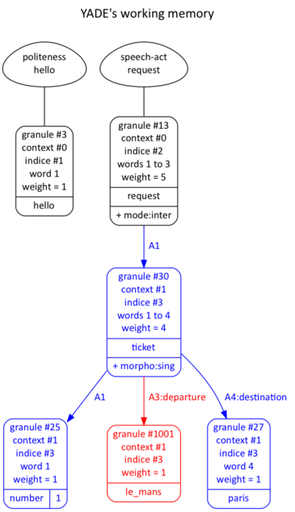
Figure 19: Working memory after dialogue #2
</center>


```
<rule descr="add departure station to a ticket" example="one ticket to Paris">
	<conditions>
		<granule concept="ticket" ident="?id">
			<granule role="destination"/>
			<nogranule role="departure"/>
		</granule>
	</conditions>
	<actions>
		<reuse-granule ident="?id">
			<create-granule concept="(get-current-station)" role="departure"/>
		</reuse-granule>
	</actions>
</rule>

### User function coded with CLIPS language:

(deffunction MAIN::get-current-station () (return le_mans))

```
<center>Figure 20: The inference rule that produced the red granule</center>

<pre>
Waiting for a connection...
Connection from xxx.xxx.xxx.xxx
Received [Hello]
Connecting to localhost:12345...
<font color="blue">### Resulting structure of granules</font>
&lt;structure text="hello">
   &lt;mot pos="1" texte="hello" lemmes="hello"/>
   &lt;granule id="3" concept="hello" code="nil" role="nil" offers="politeness hello" retained="" metadata="" text="hello" cov="1" pos="1" fin="1" root="TRUE" inferred="FALSE" rescued="FALSE" score="1"/>
&lt;/structure>
<font color="blue">### Integrating new granules</font>
<font color="blue">### Applying dialogue rules</font>
<font color="red">### Standalone rule (openning) granules=(3) salience=402 id=idm318069088768
    Response part #1 text="Hi, what can I do for you ?"</font>
--------------------------------------------------------------------------------
Waiting for a connection...
Connection from xxx.xxx.xxx.xxx
Received [Can I have]
Connecting to localhost:12345...
<font color="blue">### Resulting structure of granules</font>
&lt;structure text="can i have">
   &lt;mot pos="1" texte="can" lemmes="can"/>
   &lt;mot pos="2" texte="i" lemmes="i"/>
   &lt;mot pos="3" texte="have" lemmes="have"/>
   &lt;granule id="13" concept="request" code="nil" role="nil" offers="speech-act request" retained="" metadata="mode:inter" text="can i have" cov="3" pos="1" fin="3" root="TRUE" inferred="FALSE" rescued="FALSE" score="3"/>
&lt;/structure>
<font color="blue">### Integrating new granules</font>
<font color="blue">### Applying dialogue rules</font>
<font color="red">### Initiative rule (request without requestable) granules=(13) salience=303 id=idm318069084640
>>> Stacking a new context: stack=(1 0) rules=(idm318069084640 base)
    Response part #1 text="I did not understand well what you ask me."
    Response part #2 text="What are you looking for exactly? [timeout:5]"</font>
--------------------------------------------------------------------------------
Waiting for a connection...
Connection from xxx.xxx.xxx.xxx
Received [One ticket to Paris please]
Connecting to localhost:12345...
<font color="blue">### Resulting structure of granules</font>
&lt;structure text="one ticket to paris please">
   &lt;mot pos="1" texte="one" lemmes="one"/>
   &lt;mot pos="2" texte="ticket" lemmes="ticket"/>
   &lt;mot pos="3" texte="to" lemmes="to"/>
   &lt;mot pos="4" texte="paris" lemmes="?"/>
   &lt;mot pos="5" texte="please" lemmes="please"/>
   &lt;granule id="33" concept="ticket" code="nil" role="nil" offers="object requestable ticket" retained="" metadata="morpho:sing" text="one ticket to paris" cov="4" pos="1" fin="4" root="TRUE" inferred="FALSE" rescued="FALSE" score="4">
      &lt;granule id="27" concept="number:1" code="A1" role="nil" offers="number 1" retained="number" metadata="morpho:sing" text="one" cov="1" pos="1" fin="1" root="FALSE" inferred="FALSE" rescued="FALSE" score="1"/>
      &lt;granule id="29" concept="paris" code="A4" role="destination" offers="city station paris" retained="station" metadata="" text="paris" cov="1" pos="4" fin="4" root="FALSE" inferred="FALSE" rescued="FALSE" score="1"/>
   &lt;/granule>
   &lt;granule id="30" concept="please" code="nil" role="nil" offers="politeness please" retained="" metadata="" text="please" cov="1" pos="5" fin="5" root="TRUE" inferred="FALSE" rescued="FALSE" score="1"/>
&lt;/structure>
<font color="blue">### Integrating new granules</font>
<font color="blue">### Applying dialogue rules</font>
<font color="red">### Inference rule (add departure station to a ticket) granules=(33 29) salience=506 id=idm318069095968
==> Creating granule [le_mans]#1001 under [ticket]#33 role=departure
    Linking granule [le_mans]#1001 to [ticket]#33 role=departure
### Nested terminal rule (identifies a requestable) granules=(33) salience=205 id=idm318069079072
    Generating granule [ticket]#33 metadata=()
    Connecting to localhost:12346...
    Response part #1 text="one ticket from le mans to paris"
    Response part #2 text=", Ok."
    Linking granule [ticket]#33 to [request]#13 role=nil
&lt;&lt;&lt; Unstacking the current context: stack=(0) rules=(base)
&lt;== Granule [please]#30 becomes obsolete</font>
--------------------------------------------------------------------------------
Waiting for a connection...
</pre>
<center>Figure 21: The complete trace that corresponding to the dialogue #2</center>

<a name="section8"></a>
## 8. Bibliography<div style="float:right;">[](#Toc)</div>

- Lehuen J. (2014) **Le couple YASP/YADE : Yet Another Semantic Parser, Yet Another Dialogue Engine**, 30èmes Journées d’Études sur la Parole (JEP 2014), Le Mans (France), 23-27 juin 2014, pp. 148-156. [[Download]](http://www-lium.univ-lemans.fr/~lehuen/yadtk/Download/Papers/JEP2014.pdf)
- Lehuen J., Lemeunier T. (2010) **A Language Model for Human-Machine Dialog: The Reversible Semantic Grammar**, 7th International Workshop on Natural Language Processing and Cognitive Science (NLPCS 2010), Funchal, Madeira (Portugal), 8-9 June 2010, ISBN: 978-989-8425-13-3, pp. 17-26. [[Download]](http://www-lium.univ-lemans.fr/~lehuen/yadtk/Download/Papers/NLPCS2010.pdf)
- Lehuen J., Lemeunier T. (2010) **A Robust Semantic Parser Designed for Spoken Dialog Sytems**, 4th IEEE International Conference on Semantic Computing (ICSC 2010), Pittsburgh, PA (USA), 22-24 sept. 2010. [[Download]](http://www-lium.univ-lemans.fr/~lehuen/yadtk/Download/Papers/ICSC2010.pdf)
- Lehuen J., Lemeunier T. (2009) **Un Analyseur Sémantique pour le DHM : Modélisation, Réalisation, Evaluation**, 16ème Conférence sur les Traitements Automatiques des Langues Naturelles (TALN 2009), Senlis (France), 24-26 juin 2009. [[Download]](http://www-lium.univ-lemans.fr/~lehuen/yadtk/Download/Papers/TALN2009.pdf)
- Lehuen J. (2008) **Un modèle de langage pour le DHM : la Grammaire Sémantique Réversible**, 15ème Conférence sur les Traitements Automatiques des Langues Naturelles (TALN 2008), Avignon (France), 9-13 juin 2008. [[Download]](http://www-lium.univ-lemans.fr/~lehuen/yadtk/Download/Papers/TALN2008.pdf)


<center>
YADTK / Yet Another Dialogue Toolkit
Copyright © 2010-2015 Jérôme Lehuen
Language and Speech Technology Team
LIUM, Université du Maine

[](http://www-lium.univ-lemans.fr/~lehuen/yadtk/Download/)
